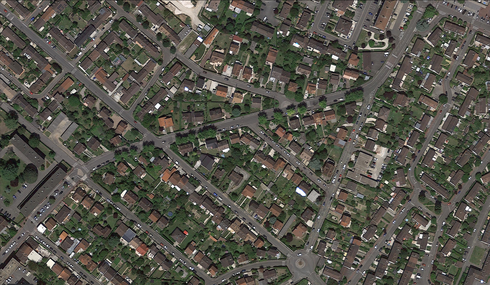

# shortest_path_prediction_from_image
shortest path prediction model given two points in an image.

Computer Vision project predicting shortest path given between two points in an image.
Roads are detected from the image shot from a drone above the ground using OpenCV.
Shortest path is calculated using Djikstra’s algorithm.
Tech Stack used: Python, Numpy, matplotlib, OpenCV.

for eg - 

input image ->

  

start point ->1017,891
      
end point -> 738,259

output image ->

  

